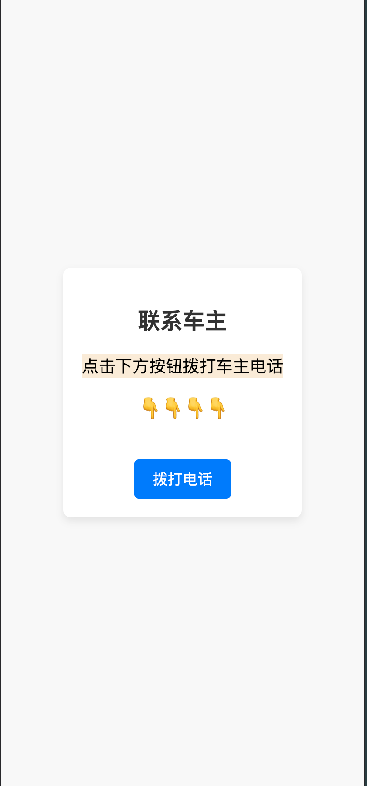
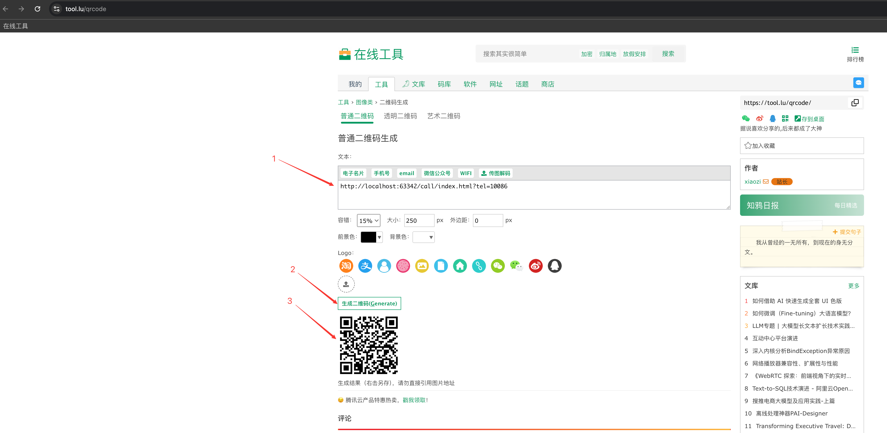

### 背景

> 在一些车主的窗户前面，一般都会放置自己的联系方式，例如：临时停车，挪车请拨打电话。
>
> 这样直接暴露自己的联系方式显然`不太好`，也有可能`不方便`联系者输入手机号码联系车主。
>
> 因此就有了扫码拨打联系。

### 介绍

#### 页面介绍

>  只是一个简单的 html 页面
> 



#### 访问链接

```http
http://localhost:63342/call/index.html?tel=10086
```

`tel`参数介绍

> `tel`需要替换成自己的手机号码

`二维码`

> 访问 [二维码生成页面](https://tool.lu/qrcode)，将`http://localhost:63342/call/index.html?tel=10086` 放入输入框中生成 `二维码`。



### 如何搭建

> 1. 通过 nigix 代理到`index`页面
> 2. 链接通过第三方平台去生成二维码

### 在线测试

> 该地址仅供测试，请勿攻击，谢谢🙏
>
> [点击测试](https://call.app.hicheer.cc:9100?tel=10086)
